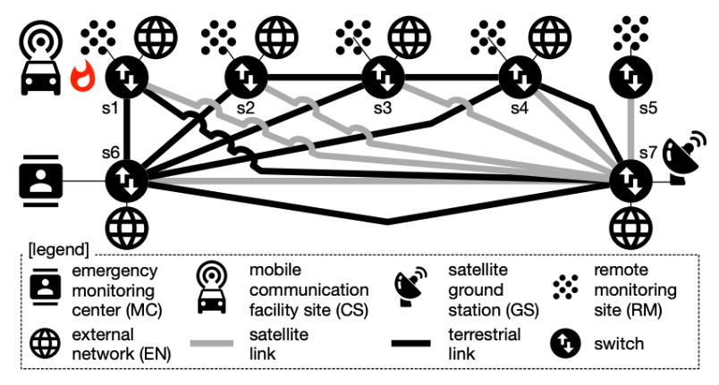
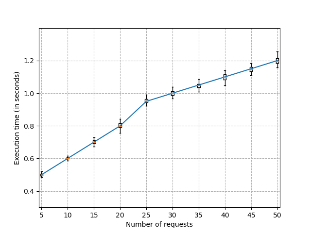

# Reproducing "Dynamic Adaptation of Software-defined Networks for IoT Systems: A Search-based Approach"

**Members:** [Agresh Bharadwaj](https://www.linkedin.com/in/agreshb/), [Ayush Garg](linkedin.com/in/ayushgarg99/), [Tulika Sureka](https://www.linkedin.com/in/tulikasureka/), [Vishnu Teja Narapareddy](https://www.linkedin.com/in/vishnu-teja-n/), and [Vivek Gupta](https://www.linkedin.com/in/guptav96/)

### Introduction
IoT-enabled applications depend on a communication network for transmitting large volumes of data in unpredictable and changing environments. 
These networks are prone to congestion when there is a burst in demand, e.g., as an emergency situation is unfolding, and therefore rely on configurable software-defined networks (SDN). The goal of this project is to reproduce the novel approach proposed in Dynamic Adaptation of Software-defined Networks for IoT Systems: A Search-based Approach (DICES) which is a dynamic adaptive SDN configuration approach for IoT systems.

     
 

### Motivation
The motivation behind reproducing this novel approach is to understand how the resolution of congestion is done in real-time by minimizing network utilization, data transmission delays, and adaptation costs. 
The approach builds on existing work in dynamic adaptive search-based software engineering (SBSE) to reconfigure an SDN while simultaneously ensuring multiple quality-of-service criteria

### Research Questions
RQ1: Efficiency and Effectiveness

Can DICES resolve congestion caused by changes in network requests over time?

RQ2 : Scalability

Can DICES resolve congestion promptly for large-scale networks?

### Methodology

We setup the required services on the aws ec2 (GiB of CPU, 2vCPUs,and 30 GB of memory) instance provided through the lab. We implement DICES as an application that runs on top of ONOS (Open Network Operating System). The project uses Mininet, a network emulator that creates a virtual network, running real SDN-switch and application programs on a single machine for easy testing and prototyping. We also use D-ITG (Distributed Internet Traffic Generator), a traffic generation and monitoring tool that replicates real network traffic. 

We implemented DICES as a java application with a Reactive Forwarding as the base code. We modified the existing reactive forwarding code in both activate and deactivate steps. In the activate step, we setup all the dependent classes and initialize these values and create a new DynamicAdaptiveControlTask (TimerTask) object. We schedule the task as a timer task run on parallel thread. We modify the existing link weight paths to inlcude our DICES generated DynamicLinkWeights when calculating the paths in reactive forwarding packet processor. In the deactivate method, we also ensure to stop the DynamicAdaptiveControlTask. This completes the setup of DICES and its integration with reactive forwarding. The full implemnetation of the DICES algorihtm can be found in the project report.

### Discussion

|  |  | 
|:--:| :--: | 
| *Figure 1* | *Figure 3* | 

|  |  | 
|:--:| :--: | 
| *Figure 2* | *Figure 4* | 

From the Figure 1 we see that the average delay in milliseconds for DICES is higher as compared to the experiment run without DICES for a congested network. This can be attributed to the time taken in finding the optimal flow so that the maximum utilization of the network can be minimized. The results obtained are comparable to the results in the paper. 
Figure 2 shows us the average packet loss in DICES is much lesser compared to ONOS Reactive Forwarding, indicating that DICES indeed helps in congestion control of the network.
From Figure 3 and 4, we can see that the execution time increases approximately in a linear fashion with the increase in the number of requests and network size. 
This answers our RQ2 stating that DICES scales to real-world systems.

### Conclusion
We conclude that this search-based approach, DICES is able to dynamically mitigate network congestion via network reconfiguration. It is realized through a feedback-loop control mechanism that executes periodically and reconfigures the SDN when the congestion is detected. The reconfiguration action is computed using a tailored multi-objective search algorithm which minimizes network-link utilization, transmission delay and reconfiguration costs. We were able to reproduce the results for the two research questions we were interested in, relating to the effectiveness and scalability of DICES. Our results indicate that: (1) DICES efficiently and effectively adapts an SDN to resolve congestion, and (2) DICES scales to real-world systems, since the execution time scales linearly with the network size and the number of requests.